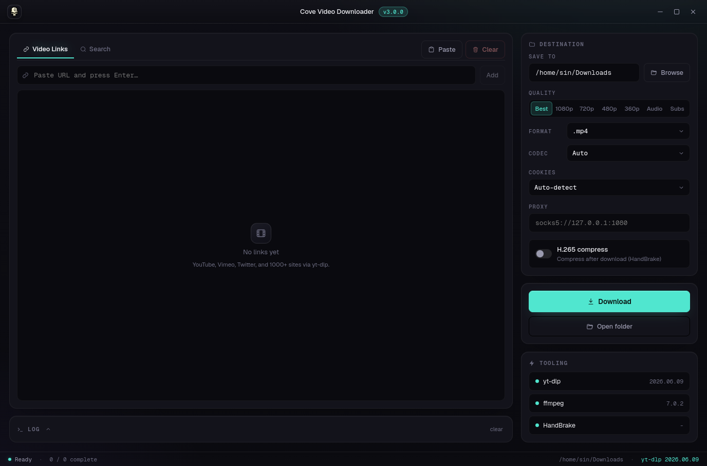

# Cove Video Downloader

<p align="center">
  
</p>

<p align="center">
  A dark-themed desktop video downloader.<br/>
  Paste a link. Hit Download. Done.
</p>


Cove Video Downloader is a thin, opinionated front-end over
[`yt-dlp`](https://github.com/yt-dlp/yt-dlp). It picks the best quality
automatically, merges video and audio into a single MP4, and optionally
re-encodes to H.265 to reclaim disk space. No format pickers, no resolution
menus, no settings you don't need.

Part of the [Cove](https://github.com/Sin213?tab=repositories&q=cove) suite
of small desktop tools.

---

## What's new in v2.0.0

A clean semver reset for the Cove suite. v2.0.0 bundles the architectural
rebuild (Electron + React) with the new format dropdowns and subtitle
downloader. From this release forward, patch / minor / major bumps follow
strict semver — bug-only fixes land as v2.0.x, new features as v2.x.0.

- **New dark UI** built in React — custom title bar, window chrome, live
  per-item progress bars, and a structured log panel with colored tags.
- **Bulk queue**: paste as many links as you want, one per line, and hit
  Download once. Each item shows its own state (fetching / downloading /
  encoding / done / error) and live speed + percent.
- **Custom output folder**, persisted between sessions, with an **Open
  Folder** button so you don't have to hunt for your downloads.
- **Auto-detected browser cookies** for Firefox / Chrome / Brave /
  Chromium / Edge — the app checks each browser's cookie database on disk
  instead of asking `yt-dlp` to probe, so detection is instant and works
  offline. Firefox is preferred because its cookies are plain SQLite
  (Chromium-family browsers on Windows 10+ use app-bound encryption that
  `yt-dlp` can't always crack).
- **YouTube signature / n-challenge solving** via the embedded Electron
  binary running as Node (`ELECTRON_RUN_AS_NODE=1`). `yt-dlp`'s newer
  releases require a JavaScript runtime for YouTube; rather than bundling
  a separate ~120 MB Deno, Cove reuses the Node runtime already inside
  Electron — no extra download.
- **Self-updating**: the app checks its own GitHub releases on launch and
  offers a one-click update when a newer version is available (from
  v1.1.0).
- **Reproducible cross-platform builds** via `electron-builder`: one `npm
  run dist:linux` / `npm run dist:win` command produces signed artifacts.
  CI builds both in parallel on tag push.

What hasn't changed: **H.265 compression settings are identical to v1.0.0**.
HandBrakeCLI at `x265`, CQ `31.5`, `--encoder-preset fast`, AAC 192 kbps —
the sweet spot the v1.0.0 release landed on.

---

## Install

Grab a build from the
[Releases page](https://github.com/Sin213/cove-video-downloader/releases):

| OS      | Artifact                                          | Notes                                  |
| ------- | ------------------------------------------------- | -------------------------------------- |
| Windows | `Cove-Video-Downloader-<version>-Setup.exe`       | NSIS installer — Start Menu + Desktop  |
| Windows | `Cove-Video-Downloader-<version>-Portable.exe`    | Single-file, no install                |
| Linux   | `Cove-Video-Downloader-<version>-x86_64.AppImage` | `chmod +x` and run                     |

**Windows SmartScreen** may warn on first launch because the `.exe` isn't
signed. Click **More info → Run anyway**.

### What ships inside each artifact

- `yt-dlp` — fetched on first launch, auto-updated thereafter (stored in
  `%APPDATA%\CoveVideoDownloader` on Windows, `~/.cove-video-downloader`
  on Linux).
- `ffmpeg` + `ffprobe` — bundled in every artifact.
- `HandBrakeCLI` — bundled on Windows. On Linux, install it yourself via
  your package manager (`sudo apt install handbrake-cli`, `sudo pacman -S
  handbrake-cli`, or equivalent) if you want the **Compress** option to
  work. Cove will detect it on `PATH` at runtime.
- A JavaScript runtime for YouTube — no separate download; Cove reuses the
  Node runtime embedded in Electron.

---

## Features

### Best quality, automatically
No format pickers. Cove always grabs the best video + audio available (4K,
1440p, 1080p, whatever the site offers) and merges them into a single MP4.
You can cap the quality to 480p / 720p / 1080p / Audio if you want
something smaller.

### Audio-only downloads
Switch **Quality** to **Audio** and pick MP3 or OGG to rip just the audio
track.

### Optional H.265 compression
The **Compress** checkbox hands the downloaded MP4 to HandBrakeCLI for
H.265 (HEVC) re-encoding. If the result is larger than the original (rare,
but happens with already-optimised sources) it's automatically discarded
and the original file is kept.

### Bulk queue
Paste many links at once — one per line — or drop them in one at a time
and hit Download. Each item runs in order with its own progress bar, speed
readout, and error state if something goes wrong.

### Smart paste
The **Paste** button and **Ctrl+V** both auto-split on whitespace so a
whole block of links from your clipboard lands as separate queue items.

### Custom save folder
Click **Browse** to pick any folder. The choice persists across launches.
**Open Folder** jumps your file manager straight there.

### Auto-detecting browser cookies
For age-restricted or login-gated videos, Cove will hand your browser
cookies to `yt-dlp` automatically. Detection is filesystem-based — no
browser launches required. Supported: Firefox, Chrome, Brave, Chromium,
Edge.

### Works on 1,000+ sites
Anything `yt-dlp` supports: YouTube, Reddit, X (Twitter), Instagram,
TikTok, Facebook, Twitch, Vimeo, Dailymotion, Bilibili, Tumblr, and
hundreds more. DRM-protected streaming services (Netflix, Disney+, etc.)
are not supported — that's a platform-level restriction, not a bug.

### Self-updating
Cove checks its own GitHub releases on launch and will offer a one-click
update when a new version ships. `yt-dlp` inside the app updates silently
every launch.

---

## Usage

1. Launch the app.
2. Copy a video link, then paste it in (**Ctrl+V** or the **Paste**
   button). Repeat for as many links as you want.
3. *(Optional)* Change **Quality**, flip **Compress**, pick a **Save To**
   folder.
4. Click **⬇ Download**.
5. Click **📂 Open Folder** to reveal your files.

---

## Running from source

Requires Node 18+ and Python 3.10+.

```bash
git clone https://github.com/Sin213/cove-video-downloader.git
cd cove-video-downloader

# One-time: fetch bundled ffmpeg (and Python embed + HandBrakeCLI on Windows)
node scripts/fetch-runtimes.js linux     # or: win

npm install
npm start
```

The Python backend (`python/backend.py`) runs as a child process of the
Electron main process, communicating over stdin/stdout with one JSON
object per line. That split keeps the `yt-dlp` / `HandBrakeCLI` plumbing
in the language it reads best in, and leaves the UI as plain
React + `contextBridge`.

---

## Building release artifacts

```bash
npm run dist:linux   # release/Cove-Video-Downloader-<v>-x86_64.AppImage
npm run dist:win     # release/Cove-Video-Downloader-<v>-{Setup,Portable}.exe
```

Each script runs `scripts/fetch-runtimes.js` first (idempotent — already
downloaded binaries are kept) and then invokes `electron-builder`.

### Automated release on tag push

Push a tag that matches `v*` (e.g. `v1.2.0`) and
`.github/workflows/release.yml` runs both platform jobs in parallel and
attaches all three artifacts to the matching GitHub Release.

---

## Built with

- [Electron](https://www.electronjs.org) — app shell and embedded Node
  runtime (doubles as the JS runtime `yt-dlp` needs for YouTube)
- [React](https://react.dev) — dark UI
- [yt-dlp](https://github.com/yt-dlp/yt-dlp) — download engine, auto-updated
- [FFmpeg](https://ffmpeg.org) — muxing, container conversion, audio extraction
- [HandBrakeCLI](https://handbrake.fr) — optional H.265 compression
- [electron-builder](https://www.electron.build) — packaging (NSIS + AppImage)
- [electron-updater](https://www.electron.build/auto-update) — self-update

---

## License

[MIT](LICENSE).
